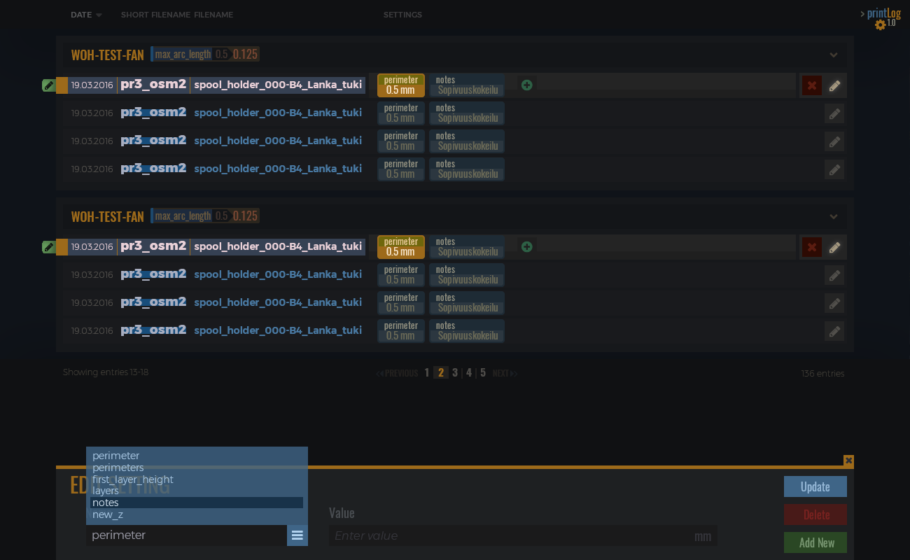

# PrintLog
Reads a log file with notes of prints and lays it on to a webpage for easier reading. A JavaScript try-out project of absolutely no real use :')



## Status
* Fully configurable log file parsing
* Data is shown on a test layout
  
### To Do
* Implement the above layout
* Adding and manipulating data

## Build

Just run Grunt with default profile.
```
grunt
```

##¤ Language & Tools
* [Bootstrap 3.3.7](https://maxcdn.bootstrapcdn.com/bootstrap/3.3.7/css/bootstrap.min.css) for responsive layout
* [jQuery 3.3.1](https://ajax.googleapis.com/ajax/libs/jquery/3.1.1/jquery.min.js) for Bootstrap and general use